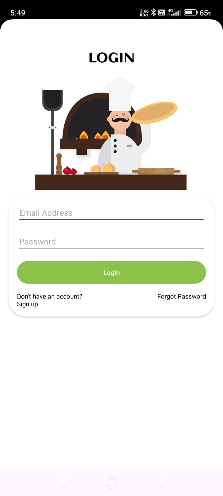
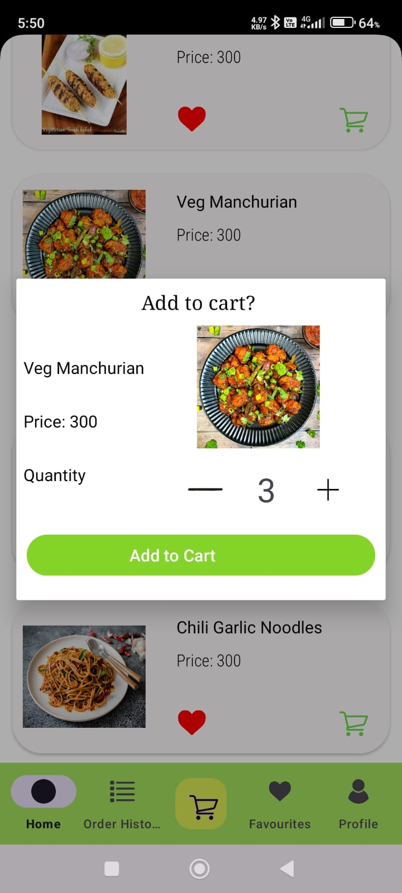
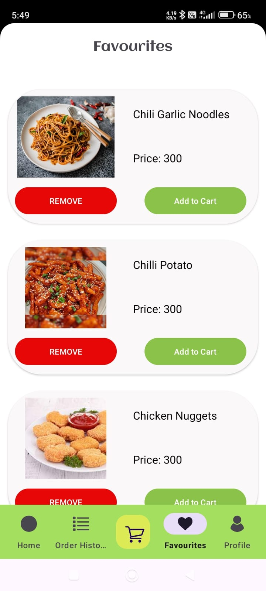
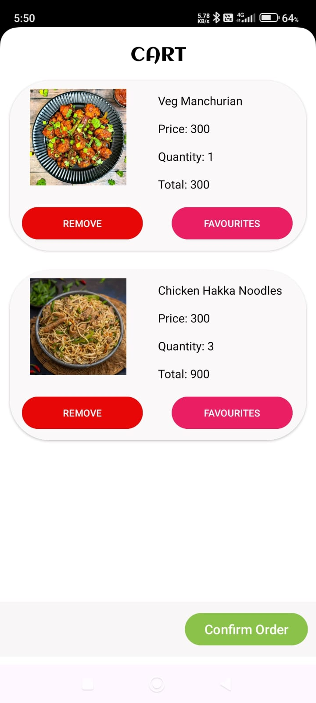
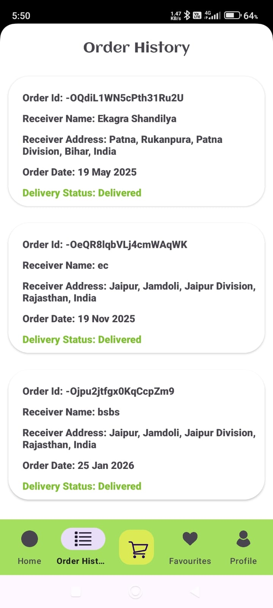

<h1 align="center">🍽️ Mom's Kitchen</h1>

  An Android food ordering app designed as if a restaurant built its own delivery system.

<h2>📖 About the App</h2>

Mom’s Kitchen is a complete food ordering application built for Android.  
It simulates a real restaurant workflow where users can browse menu items, add them to favorites or cart,
place orders, track order history, and manage their profile — all inside a single app.

The focus of the app is simplicity, smooth navigation, and a real-world ordering experience rather than
acting as a large aggregator like Swiggy or Zomato.

<h2>⚙️ How the App Works</h2>

<ul>
  <li>User signs up or logs in using email authentication</li>
  <li>Email verification ensures only verified users can access the app</li>
  <li>Menu items are fetched from Firebase and displayed category-wise</li>
  <li>Users can add items to favorites or cart</li>
  <li>Address details are auto-filled using device location</li>
  <li>Orders are confirmed and stored in order history</li>
</ul>

<h2>✨ Core Features</h2>

<ul>
  <li>Category-wise menu browsing</li>
  <li>Add / remove items from favorites</li>
  <li>Cart management with quantity control</li>
  <li>Order history with detailed summary</li>
  <li>User profile section</li>
  <li>Smooth UI using bottom navigation and FAB</li>
</ul>

<h2>🛠️ Technologies Used</h2>

<ul>
  <li><strong>Firebase Authentication</strong> – Signup, login, email verification</li>
  <li><strong>Firebase Realtime Database</strong> – Menu, favorites, cart, orders, profile data</li>
  <li><strong>Picasso</strong> – Image loading and caching</li>
  <li><strong>Lottie Animations</strong> – Success and error animations</li>
  <li><strong>Location Services</strong> – Auto-fill delivery address</li>
</ul>

<h2>🚧 Challenges Faced</h2>

Managing data flow through multiple adapter classes was initially challenging,
especially while sending and retrieving data from Firebase.
This led to crashes due to incorrect data handling.

Through debugging and refactoring, the data flow was stabilized,
resulting in smoother performance and reliable app behavior.

<h2>📌 Notes</h2>

This project was built as a self-learning and showcase project.
It represents how a standalone restaurant could design and manage its own food delivery application.

<h2>📷 Screenshots</h2>

